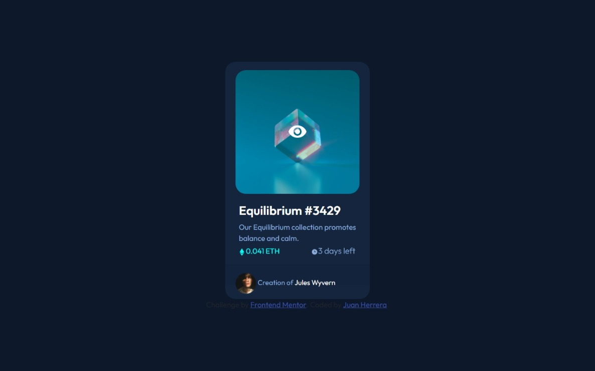
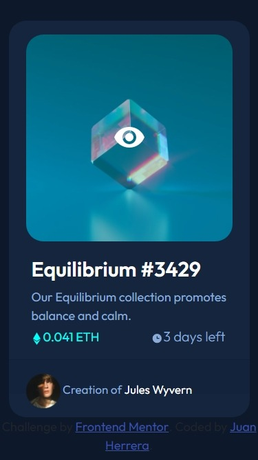

# Frontend Mentor - NFT preview card component solution

This is a solution to the [NFT preview card component challenge on Frontend Mentor](https://www.frontendmentor.io/challenges/nft-preview-card-component-SbdUL_w0U). Frontend Mentor challenges help you improve your coding skills by building realistic projects. 

## Table of contents

- [Frontend Mentor - NFT preview card component solution](#frontend-mentor---nft-preview-card-component-solution)
  - [Table of contents](#table-of-contents)
  - [Overview](#overview)
    - [The challenge](#the-challenge)
    - [Screenshot](#screenshot)
    - [Links](#links)
  - [My process](#my-process)
    - [Built with](#built-with)
    - [What I learned](#what-i-learned)
    - [Continued development](#continued-development)
  - [Author](#author)
  - [Acknowledgments](#acknowledgments)

## Overview

### The challenge

Users should be able to:

### Screenshot
Desktop


Mobile



### Links

- Solution URL: [GitHub repository](https://github.com/Juan13052001/NFT-challenge)
- Live Site URL: [My Site](https://your-live-site-url.com)

## My process

### Built with

- Semantic HTML5 markup
- CSS custom properties
- Bootstrap

### What I learned

I learned the opacity property and how we can give it that style of something sticking out when you move the mouse.
```css
.view {
    margin-top: 125px;
    opacity: 0%;
}

.view:hover {
    opacity: 100%;
}

.hidden {
    text-align: center;
    position: absolute;
    background-color: hsla(178, 100%, 50%, 0);
    border-radius: 25px;
    width: 300px;
    height: 300PX;
    margin: 20px 15px 0;
    top: 0px;
    left: 10px;
}

.hidden:hover {
    background-color: hsla(178, 100%, 50%, 0.3);
}
```

**Note: Delete this note and the content within this section and replace with your own learnings.**

### Continued development

Improve the design of cards and learn about Bootstrap classes
## Author


- Frontend Mentor - [@Juan13052001](https://www.frontendmentor.io/profile/Juan13052001)

## Acknowledgments

This is where you can give a hat tip to anyone who helped you out on this project. Perhaps you worked in a team or got some inspiration from someone else's solution. This is the perfect place to give them some credit.

**Note: Delete this note and edit this section's content as necessary. If you completed this challenge by yourself, feel free to delete this section entirely.**
